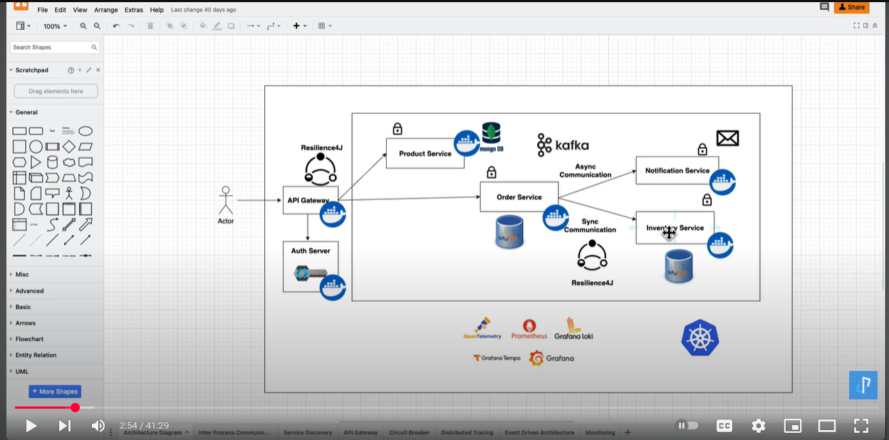
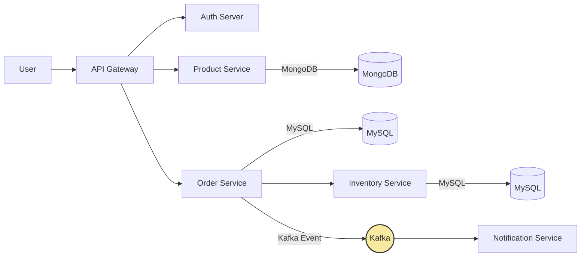

# ecom-microservices-backend
Microservices-based E-commerce Platform with Event-Driven Architecture | Built with Spring Boot, Kafka, Resilience4j, Kubernetes, and Observability Stack ( Grafana)

# 📦 Event-Driven E-Commerce Microservices Platform  
A Production-Ready Spring Boot | Kafka | Kubernetes Architecture



## 📝 Overview
This project is a cloud-native, event-driven **E-Commerce Microservices Platform** built using:

- Spring Boot 3  
- Kafka (Async events)  
- MySQL & MongoDB  
- Docker & Kubernetes  
- Prometheus, Grafana, Loki  
- Resilience4J (Circuit Breakers)  
- OpenTelemetry (Distributed Tracing)

It demonstrates a real-world scalable architecture with both synchronous and asynchronous communication patterns, making it suitable for enterprise-level workloads.

---

## 🧩 Architecture Components

### **1. API Gateway**
- Entry point for all clients  
- Performs routing & authentication checks  

### **2. Auth Server**
- Issues JWT tokens  
- Protects API routes  

### **3. Product Service**
- Stores product catalog  
- MongoDB backend  
- Sync/async interaction with Order Service  

### **4. Order Service**
- Manages order creation  
- Saves orders in MySQL  
- Sends Kafka events to Notification Service  
- Sync calls to Inventory Service  

### **5. Inventory Service**
- Manages product stock  
- MySQL backend  

### **6. Notification Service**
- Kafka consumer  
- Sends email/message alerts  

### **7. Kafka Event Bus**
- Powers async communication  
- Loose coupling between services  

### **8. Resilience4J**
- Circuit breaker  
- Retry logic  
- Rate limiting  

### **9. Monitoring Stack**
- Prometheus
- Grafana Dashboard
- Loki Logs
- OpenTelemetry Tracing  

---

## 🖼 Architecture Diagram (Markdown Version)



---

## 🙏 Honest Confession (Transparent & Professional)
I want to openly acknowledge that I initially learned this architecture by following a step-by-step **YouTube tutorial**.  
However, I did not simply copy it — I deeply understood concepts such as:

- Event-driven design  
- Microservice communication patterns  
- Kafka message flows  
- Circuit breaker design  
- Docker + Kubernetes deployment  
- Cloud-native monitoring  

Using this knowledge, I am now **building and adapting a real event-driven Spring Boot application for my company**, integrating:

- Custom business workflows  
- Internal APIs  
- Scalable Kafka-based processing  
- Enterprise authentication  
- Production deployment practices  

This repository captures my learning + real-world application.

---

## 📚 Tech Stack

| Layer | Technology |
|------|------------|
| Language | Java 17 |
| Framework | Spring Boot 3 |
| Messaging | Apache Kafka |
| Databases | MongoDB, MySQL |
| Security | Spring Security + JWT |
| Deployment | Docker, Kubernetes |
| Monitoring | Prometheus, Grafana, Loki |
| Resilience | Resilience4J |
| Tracing | OpenTelemetry |

---

## 🏗 Folder Structure

```bash
event-driven-ecommerce-microservices/
│
├── api-gateway/
├── auth-service/
├── product-service/
│   └── src/main/java/...
│   └── Dockerfile
│
├── order-service/
├── inventory-service/
├── notification-service/
│
├── kafka/
│   └── docker-compose.yml
│
├── k8s-deployments/
│   ├── product-deployment.yml
│   ├── order-deployment.yml
│   └── ...
│
├── monitoring/
│   ├── prometheus.yml
│   ├── grafana/
│
├── docs/
│   └── architecture.png
│
└── README.md
```

---

## ▶️ How to Run the Project (Local)

### **1. Start Kafka, Zookeeper, MongoDB, MySQL**
```bash
docker-compose up -d
```

### **2. Build All Microservices**
```bash
mvn clean install
```

### **3. Start Each Service**
```bash
cd product-service
mvn spring-boot:run
```

(or run with Docker)

```bash
docker build -t product-service .
docker run -p 8081:8081 product-service
```

---

## 📡 API Flow Example

1️⃣ Client → API Gateway  
2️⃣ Gateway → Auth Server (JWT validation)  
3️⃣ Gateway → Order Service  
4️⃣ Order Service → Inventory (sync stock check)  
5️⃣ Order Service → Kafka (order-created event)  
6️⃣ Notification Service → Sends email  

---
